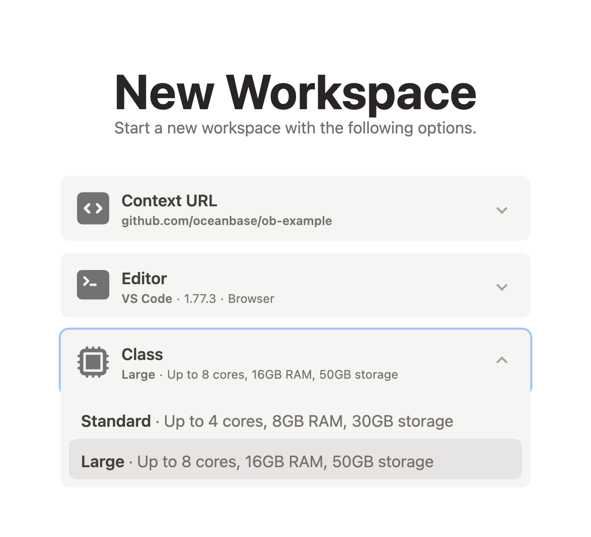
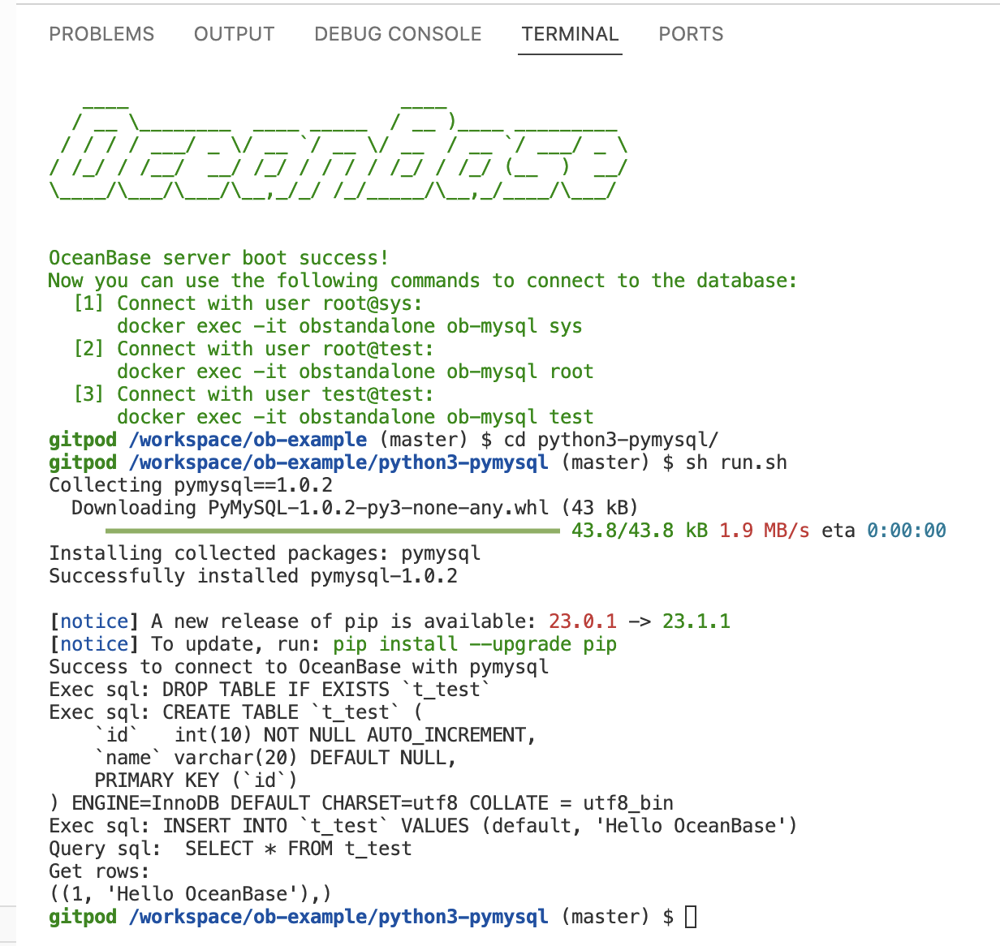

# OceanBase Examples

[English](README.md) | 简体中文

## 快速开始

本仓库基于 Gitpod 建立了快速在线体验平台, 点击下面按钮一键体验（建议使用 Chrome 浏览器）

[](https://gitpod.io/#https://github.com/oceanbase/ob-example)

需要注意的是，创建 Gitpod 工作区时需要选择大规格，否则可能会因为磁盘空间不足而部署失败。



打开新创建的 Gitpod 工作区后，Gitpod 会自动部署一个 OceanBase 本地实例，请耐心等待，直到终端界面显示如下表示部署成功的信息，之后您就可以在工作区使用该 OceanBase 实例了。



### 使用示例代码

本仓库提供了不同语言和工具连接 OceanBase 的示例，您可以按下面步骤进行操作，通过 `run.sh` 在 Gitpod 环境直接运行示例代码。

```bash
// 进入目录
cd xxxx
// 执行示例代码
sh run.sh
```

这里以 python3-pymysql 为例

```bash
cd python3-pymysql
sh run.sh
```

## 贡献

我们欢迎任何人来贡献，感谢所有的[贡献者](https://github.com/oceanbase/ob-example/graphs/contributors)！

在本仓库中，每个子目录都是一个独立的项目，命名格式为 `{编程语言}-{组件名称}`。

在您提交 Pull Request 前，我们建议您先在 Gitpod 上创建一个 [workspace](https://gitpod.io/workspaces/)，以对您的 fork 分支进行测试和验证。

最终，在新增的目录中，应当至少包含以下几个文件：
- 代码文件
- `run.sh` 运行代码的脚本
- `README.md` 组件用法的介绍文档

## 参考信息

关于更多 OceanBase 的细节请参考 [社区官网](https://open.oceanbase.com).
