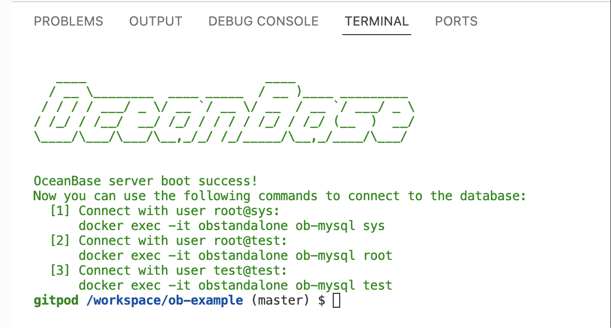

# OceanBase Examples

[English](README.md) | 简体中文

## 介绍

本仓库提供了 OceanBase 的示例项目。 它包含以下目录：

- [`examples`](examples)：该目录包含所有示例项目。
- [`tests`](tests)：该目录包含用于测试的资源。
- [`tools`](tools)：该目录包含脚本和其他工具。

### 示例项目

示例项目按照如下类型进行分类：

- [`application`](application): 应用程序框架如网络服务框架。
- [`connection-pool`](connection-pool): 数据库连接池。
- [`data-integration`](data-integration): 数据集成框架。
- [`driver`](driver): 数据库驱动。
- [`middleware`](middleware): 中间件。
- [`orm`](orm): ORM（对象关系映射）框架。

在这些类型目录下，项目文件夹一般以 `{编程语言}-{组件名称}` 的格式命名。 目前，本仓库包含以下组件的示例：

#### [数据库驱动](examples/driver)

- (golang) [go-sql-driver](examples/driver/golang-go-sql-driver)
- (java) [mysql-connector-java](examples/driver/java-mysql-connector-java)
- (java) [oceanbase-client](examples/driver/java-oceanbase-client)
- (python3) [pymysql](examples/driver/python3-pymysql)

## 快速开始

本仓库基于 Gitpod 建立了快速在线体验平台, 点击下面按钮一键体验（建议使用 Chrome 浏览器）

[](https://gitpod.io/#https://github.com/oceanbase/ob-example)

需要注意的是，创建 Gitpod 工作区时需要选择大规格，否则可能会因为磁盘空间不足而部署失败。

打开新创建的 Gitpod 工作区后，Gitpod 会自动部署一个 OceanBase 本地实例，请耐心等待，直到终端界面显示如下表示部署成功的信息，之后您就可以在工作区使用该 OceanBase 实例了。



### 体验示例项目

您可以按下面步骤进行操作，在 Gitpod 上体验示例项目：

```bash
// 进入目录
cd xxxx
// 执行示例代码
sh run.sh
```

这里以 python3-pymysql 为例，注意 Gitpod 环境的工作空间默认为 `/workspace/ob-example`：

```bash
cd /workspace/ob-example/examples/driver/python3-pymysql
sh run.sh
```

## 贡献

我们欢迎任何人来贡献，感谢所有的[贡献者](https://github.com/oceanbase/ob-example/graphs/contributors)！

在这个仓库中，同类型的示例项目放在同一个目录下，项目目录的命名格式为 `{编程语言}-{组件名称}`。

在您提交 Pull Request 前，我们建议您先在 Gitpod 上创建一个 [workspace](https://gitpod.io/workspaces/)，以对您的 fork 分支进行测试和验证。

最终，在新增的目录中，应当至少包含以下几个文件：

- 代码文件
- `run.sh` 运行代码的脚本
- `README.md` 组件用法的介绍文档

## 参考信息

关于更多 OceanBase 的细节请参考 [社区官网](https://open.oceanbase.com).
